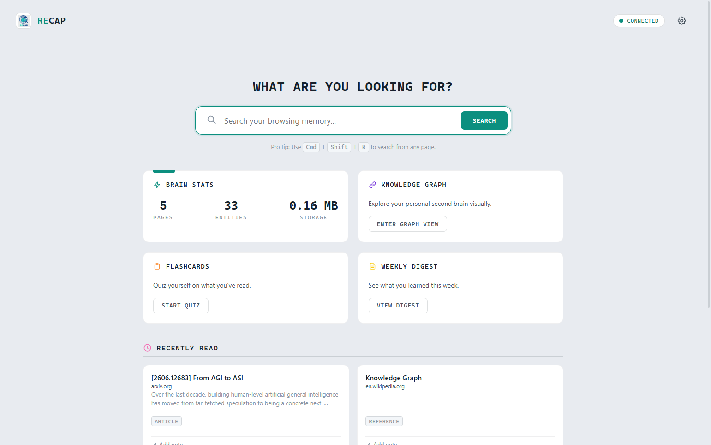
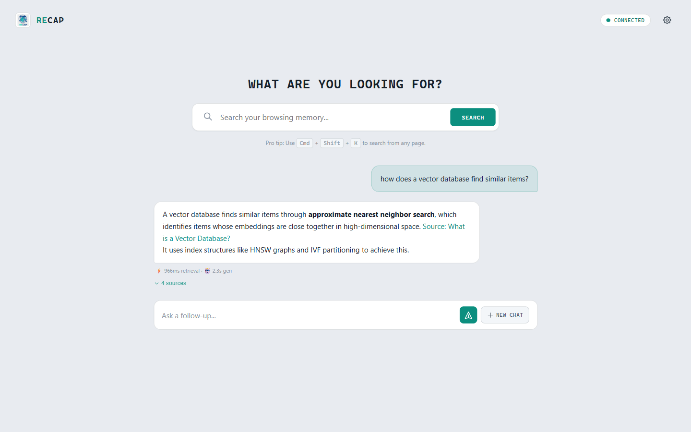
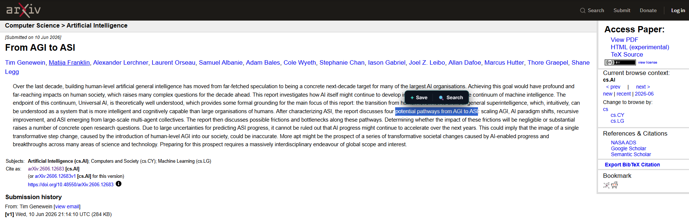
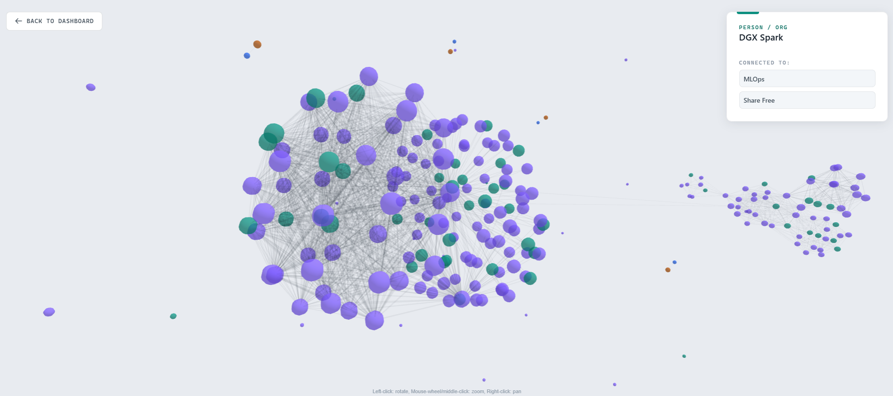
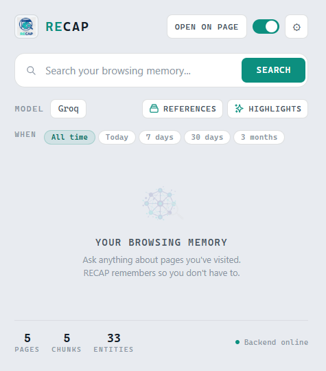

# RECAP

A Chrome extension that remembers the pages you read and lets you search them in plain English. It quietly indexes the content of pages you spend time on, keeps everything on your own machine, and answers questions about your browsing history using retrieval-augmented generation (RAG).

Nothing about your browsing is sent anywhere except the local backend on your own computer - and, only when you ask a question, the LLM provider you chose.



## How it works

Two parts:

- **Chrome extension** - tracks the pages you actually read, extracts their text, and gives you the search UI (new-tab dashboard, toolbar popup, and a `Ctrl+Shift+K` omnibar). It skips sensitive sites (banking, email, logins, password managers, AI chats) by default.
- **Python backend** - a local FastAPI server that chunks and indexes page content, then answers queries with hybrid retrieval (keyword + semantic + a small knowledge graph) and an LLM.

```
page visit  → extract text → chunk → embed → store (SQLite + LanceDB + graph)
your question → keyword + vector + graph search → rerank → LLM answer with sources
```

## Setup

### Backend

Requires **Docker** (recommended) or **Python 3.11-3.13**. All three paths below install
spaCy + the `en_core_web_sm` model, so the knowledge graph works out of the box.

**Docker - recommended (nothing to install but Docker):**

```bash
cp .env.example .env          # optional: add an LLM key now, or set it later in the extension
docker compose up --build     # first run downloads the ML wheels; then serves :8000
```

**uv - fast, reproducible local dev:**

```bash
uv sync                       # installs all deps + the spaCy model into .venv
uv run python main.py
```

**pip - simple fallback:**

```bash
pip install -r requirements.txt
python main.py
```

The server runs on `http://127.0.0.1:8000` (loopback only - never exposed to your network).

Add at least one LLM. RECAP talks to any **OpenAI-compatible** endpoint, so you just provide a key (and optionally a model). Copy `.env.example` to `.env` and fill in one of `GROQ_API_KEY`, `OPENAI_API_KEY`, `ANTHROPIC_API_KEY`, `GOOGLE_API_KEY`, or `OPENROUTER_API_KEY` - or point `LLM_BASE_URL` at a self-hosted server (Ollama, vLLM, LM Studio). You can also set all of this from the extension's Options page.

> **Running in Docker + a local Ollama?** The container can't reach the host's `localhost`. Point RECAP at `http://host.docker.internal:11434/v1` instead - set `LLM_BASE_URL` (provider `custom`) and, if you use Ollama for embeddings, `EMBEDDING_BASE_URL`. Cloud providers (Groq, OpenRouter, …) need no extra networking.

### Chrome extension

1. Open `chrome://extensions/`
2. Turn on **Developer mode**
3. Click **Load unpacked** and select the `extension/` folder

## Usage

Browse normally. Pages you read for a while (30s+ by default) get indexed. Then:

- Open a new tab (the RECAP dashboard) or the toolbar popup to search
- Press `Ctrl+Shift+K` on any page for the quick search bar
- Select text and press `Ctrl+Shift+S` (or right-click → **Save to RECAP**) to save a highlight
- Ask things like *"what was that article about vector databases I read last week?"*

Answers are generated only from pages you actually read, with citations back to the source:



Select text on any page to save it as a highlight or search your history with it - and RECAP resurfaces related pages you've read before:



| Knowledge graph of entities across your pages | Toolbar popup |
| :---: | :---: |
|  |  |

## Configuration

Settings live in `backend/config.py` and can be overridden in `.env`. The extension's Options page covers the backend URL, minimum visit duration, default LLM, and API keys.

Defaults: embeddings `BAAI/bge-base-en-v1.5`, reranker `cross-encoder/ms-marco-MiniLM-L-6-v2`, vector store LanceDB, metadata + keyword search in SQLite (FTS5).

## Privacy & storage

- All indexed data stays on your machine (SQLite + LanceDB under `data/`).
- Sensitive domains and login/checkout/account pages are excluded by default; you can add your own.
- Page content only leaves your machine when you ask a question, and only the retrieved snippets go to the LLM provider you selected.
- API keys are stored locally, not synced to the cloud.
- **Bounded storage.** Pages you haven't visited in `RETENTION_DAYS` (default 120 ≈ 4 months) are automatically evicted, so the index reaches a steady size instead of growing forever. Set `RETENTION_DAYS=0` to keep everything.
- Each chunk's text is stored once (in SQLite). The keyword index (FTS5) and vector store (LanceDB) are derived indexes keyed by chunk id - no duplicated content.

## Testing

```bash
python tests/test_integration.py
```

Ten checks covering config, storage, retrieval, and the end-to-end pipeline - no pytest needed. Run it before opening a PR (see [AGENTS.md](AGENTS.md) for contributor conventions).

## License

MIT - see [LICENSE](LICENSE).
